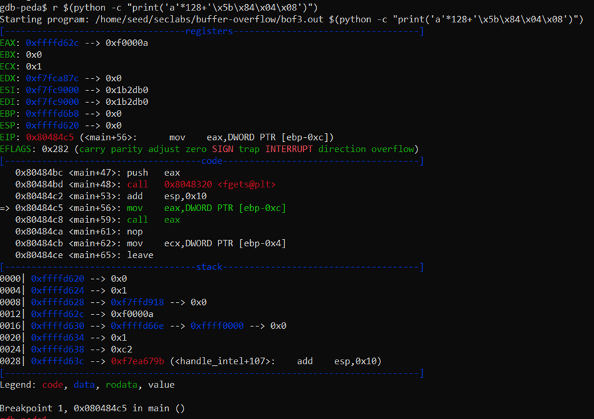

# REPORT LAB

| Student ID | Full Name |
| :--- | :--- |
| 20110431 | Tang Tam Nhu |

___Lab#1:___ Conduct buffer overflow attack on bof1.c, bof2.c, bof3.c programs

| Labs | Explanation |
| :---| :--- |
| bof1.c |    Ta có mảng chứa 200 bytes trong stack. Để thực thi secretFunc, ta sẽ đặt địa chỉ bộ nhớ của nó vào địa chỉ trả về (eip), để chương trình có thể tràn bộ đệm và dễ dàng thêm địa chỉ của secretFunc vào địa chỉ trả về (eip) chọn 204 bytes. Đặt một điểm dừng ngay sau vuln() trong main rồi kiểm tra địa chỉ của secretFunc. Chạy lệnh python nhưng cuối cùng lại có vấn đề.   Đọc thanh ghi esp, không có 'b' trong bộ nhớ.  | 
| bof2.c |   Chương trình có 40 byte buf, 4 byte var và 4 byte check. Để làm check == 0xdeadbeef, làm tràn bộ đệm bằng cách nhập 40 byte vào ngăn xếp, sau đó thêm ‘0xdeadbeef’ vào biến check. Đặt breakpoint tại 0x08048564 và làm tương tự như cách ở bof1.c.   [buf] in ra chuỗi đã nhập, với ký tự cuối cùng là phần được ghi đè lên check.[check] sẽ in giá trị 0xdeadbeef, vì dữ liệu đầu vào đã ghi đè check với giá trị này. Chương trình sẽ in "Yeah! You win!" vì điều kiện check == 0xdeadbeef đã được thoả mãn.|
| bof3.c |  Chương trình, có 128 byte buf, 4 byte var, 4 byte func(). Để shell() thực thi, tôi làm tràn bộ đệm bằng cách nhập 128 byte vào ngăn xếp, sau đó thêm địa chỉ của shell vào không gian địa chỉ trả về. Tương tự như bof1 và bof2 ta biên dịch chương trình bof3 như sau.  Lấy địa chỉ của hàm shell và làm tương tự như bof1.     Sau khi thực hiện tấn công tràn bộ đệm, bạn mong đợi chương trình in ra thông báo từ hàm shell thay vì sup.|